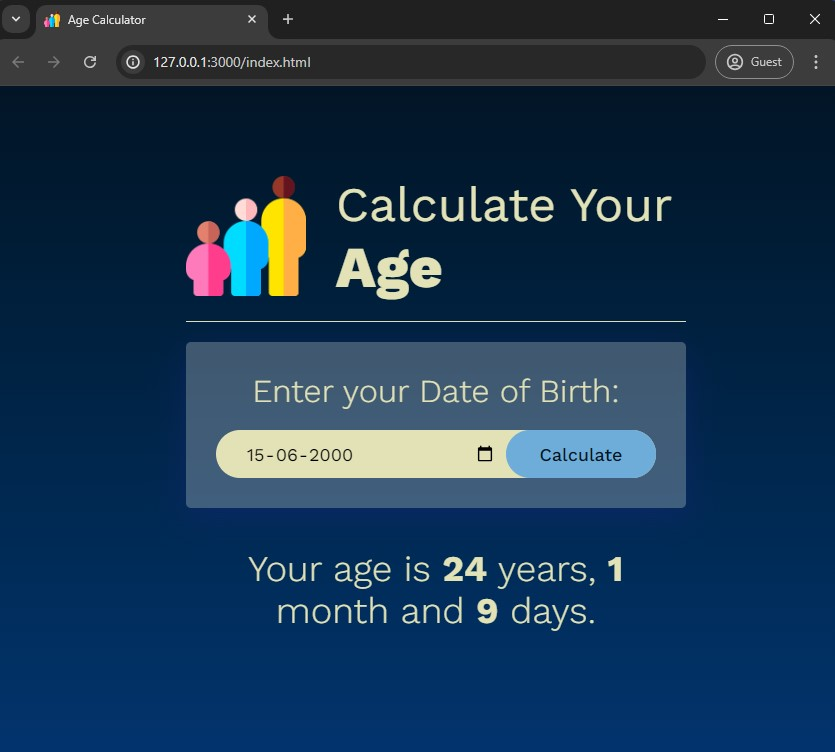

# Age Calculator

The Age Calculator is a simple web application that allows users to calculate their age based on their date of birth. The application provides the age in years, months, and days.

## Table of Contents

- [Demo](#demo)
- [Features](#features)
- [Installation](#installation)
- [Usage](#usage)
## Demo




## Features

- User-friendly interface
- Real-time age calculation
- Responsive design for different screen sizes


## Installation

To get a local copy up and running follow these simple steps:

1. Clone the repository:
   ```sh
   git clone https://github.com/aimless-coder/Age_Calculator.git
   ```

2. Open `index.html` in your browser

    
## Usage

- Open `index.html` in your web browser.
- Enter your date of birth in the provided input field.
- Click the "Calculate" button to see your age displayed in years, months, and days.


